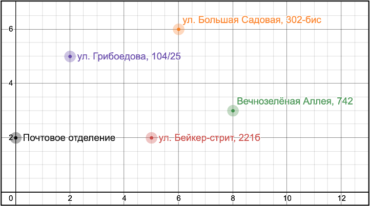

# Модифицированная задача почтальона/курьера (вычисление кратчайшего пути для дрона) #

:gb: [English version here](README.md)

----

## Содержание ##

[1. Условия задания](#условия-задания)    
[2. Описание решения](#описание-решения)    
[3. Результат](#результат)    
[4. Инструкция по запуску проекта](#инструкция-по-запуску-проекта)    

## Условия задания ##

- Разработать программу для вычисления кратчайшего пути для полёта почтового
дрона. Дрон стартует из почтового отделения, облетает всех адресатов один раз
для доставки посылок и возвращается в почтовое отделение.    
Заданы карта адресатов и координаты соответствующих точек. Необходимо найти
кратчайший маршрут для облёта.

- Карта адресатов    

- Координаты точек:

    1. Почтовое отделение – **(0, 2)**
    2. Ул. Грибоедова, 104/25 – **(2, 5)**
    3. Ул. Бейкер стрит, 221б – **(5, 2)**
    4. Ул. Большая Садовая, 302-бис – **(6, 6)**
    5. Вечнозелёная Аллея, 742 – **(8, 3)**

[:arrow_up: Содержание](#содержание)

----

## Описание решения ##

[:arrow_up: Содержание](#содержание)

----

## Результат ##

[:arrow_up: Содержание](#содержание)

----

## Инструкция по запуску проекта ##

[:arrow_up: Содержание](#содержание)

----
