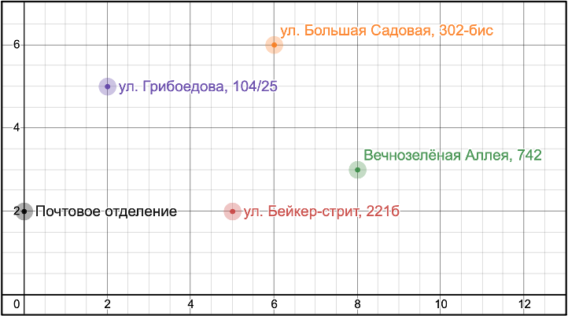
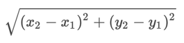

# Домашнее задание для курса "Основы Python". Переменные, условия и циклы

## Задача

Разработать программу для вычисления кратчайшего пути для почтальона.

### Описание задачи
Почтальон выходит из почтового отделения, объезжает всех адресатов один раз для вручения посылки
и возвращается в почтовое отделение.

Необходимо найти кратчайший маршрут для почтальона.

### Карта адресатов



#### Координаты точек

1. Почтовое отделение – **(0, 2)**
2. Ул. Грибоедова, 104/25 – **(2, 5)**
3. Ул. Бейкер стрит, 221б – **(5, 2)**
4. Ул. Большая Садовая, 302-бис – **(6, 6)**
5. Вечнозелёная Аллея, 742 – **(8, 3)**

#### Описание решения

Общее количество всех возможных путей проезда вычисляется по формуле **(n - 1)!**,
где **n** – количество точек (адресатов).

Расчёт количества возможных маршрутов объезда адресатов для данной карты: *(5 - 1)! = 4! = 24 (маршрута)*.
Необходимо найти кратчайший маршрут и вывести последовательность точек, которые его составляют.

Для поиска такого маршрута необходимо вычислять расстояния между точками, составляющих маршрут.
Это позволит найти общую длину маршрута. Путем перебора длин всех возможных маршрутов найти самый короткий из них.

Расстояние между двумя точками на плоскости вычисляется по формуле:


Где *x1* и *y1* – координаты первой точки, *x2* и *y2* – координаты второй точки. 

#### Пример кода

Вычисление расстояния между двумя точками на плоскости:

```python
point_1 = (0, 2)  # координаты первой точки
point_2 = (2, 5)  # координаты второй точки

# подстановка значений в формулу
((point_2[0] - point_1[0]) ** 2 + (point_2[1] - point_1[1]) ** 2) ** 0.5
# результат – 3.605551275463989
```

### Требования к выходным данным

Результат выполнения программы должен содержать последовательность точек,
которые составляют самый короткий из маршрутов с выводом промежуточных расстояний
для каждой точки (от начала до текущей точки) и общей длины маршрута.

#### Пример результата работы программы

Результат работы программы может быть оформлен следующим образом:
```
(0, 1) -> (1, 4)[3.1622776601683795] -> (4, 1)[7.404918347287664] -> (5, 5)[11.528023972905324] -> (7, 2)[15.133575248369313] -> (0, 1)[22.204643060234787] = 22.204643060234787
```

Координаты точек, следующие друг за другом, показывают найденный кратчайший путь с указанием промежуточной длины пути у каждой следующей точки.
Полная продолжительность всего маршрута указана после символа равенства.
