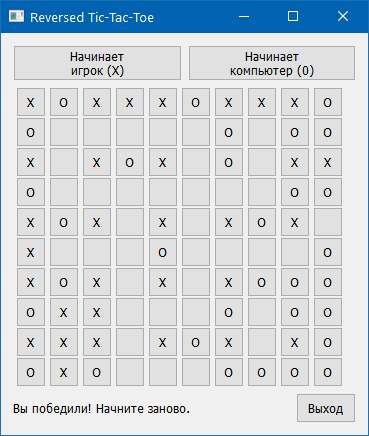

# Тестовое задание «Обратные крестики-нолики» #

Разработать игру «Обратные крестики-нолики» на поле 10 x 10 с правилом «Пять в
ряд» – проигрывает тот, у кого получился вертикальный, горизонтальный или
диагональный ряд из пяти своих фигур (крестиков/ноликов).    
Игра должна работать в режиме «человек против компьютера».    
    
Игра может быть консольной или поддерживать графический интерфейс (будет плюсом,
но не требуется).    
    
При разработке игры учесть принцип DRY (don’t repeat yourself) – «не повторяйся».
То есть минимизировать повторяемость кода и повысить его переиспользуемость за
счёт использования функций. Функции должны иметь свою зону ответственности.    
    
Критерии оценки:    
1. Качество алгоритмов.    
2. Принцип DRY.    
3. Качество оформления кода (наименования переменных, форматирование, документация).    

----
## Решение ##

[**`cli_mode.py`**](https://github.com/wildfielded/samples-python/blob/master/YLabTrain2/cli_mode.py) -
Игра в командной строке (CLI).    
Игрок ходит крестиками, компьютер - ноликами. Пустые клетки игрового поля
обозначены точками. Для удобства справа приведены номера строк, сверху - номера
колонок. Отсчёт слева направо и сверху вниз.    
Вначале предлагается выбрать, кто делает первый ход - игрок (1) или компьютер (2).
Ход игрока вводится в формате **номер_строки / номер_колонки** цифрами через дробь.
(все пробелы устраняются). Если координаты клетки выходят за допустимый диапазон,
строку ввода нельзя интерпретировать, или клетка уже занята - ход не производится,
надо вводить заново.    
Игра заканчивается, если по любому направлению образуется ряд из пяти крестиков
("Вы проиграли"), ноликов ("Вы выиграли"), или если не остаётся свободных клеток
("Ничья").    
На любом ходу можно выйти из игры, если вместо координат ввести "q" или "Q".    
    
[**`win_mode.py`**](https://github.com/wildfielded/samples-python/blob/master/YLabTrain2/win_mode.py) -
Графический вариант игры. Требует установки:    
~~~
pip install PyQt5
~~~
Использованы функции из CLI-варианта игры, адаптированные под графику (для
переиспользования при прямом импорте модуля требуется рефакторинг).    
Игрок ходит крестиками, компьютер - ноликами. Клетки игрового поля представлены
кнопками, на которые нужно нажать, чтобы сделать ход. По умолчанию первый ход за
игроком. В любой момент можно выйти из игры по кнопке "Выход" или начать новую
игру по соответсвующим кнопкам. Интерфейс минималистичен, "интуитивно понятен" и
готов к любым "раскраскам".    
    
**TODO:** Можно попытаться в PyQt5 полностью избавиться от **lambda** через
функции высшего порядка.

----
## Краткое описание алгоритма ##

После каждого хода, как игрока, так и компьютера, клеткам *прибавляются* весовые
коэффициенты из соответстующих наборов (кортежей) для игрока (DUDE_WEIGHTS) и
компьютера (COMP_WEIGHTS). То есть "интеллект" игры за компьютер можно отрегулировать,
играясь с весовыми значениями в кортежах.    
Изначально вес каждой клетки нулевой. Как только сделан ход, клетке с поставленным
символом к имеющемуся весу *прибавляется* первый весовой коэффициент из кортежа.
Следующие 4 "веса" в кортеже прибавляются последовательно по мере удаления четырём
клеткам в линии по каждому направлению (вверх, вниз, влево, вправо и по четырём
диагоналям).    
Чтобы сделать ход, компьютер из свободных клеток выбирает список клеток с
минимальным на текущий момент весом, и уже из этого списка делает случайный выбор
с помощью **`random.choice()`**.    

----
